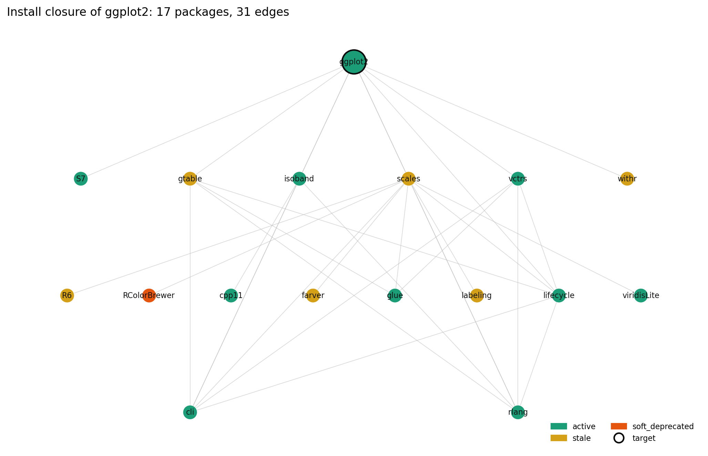
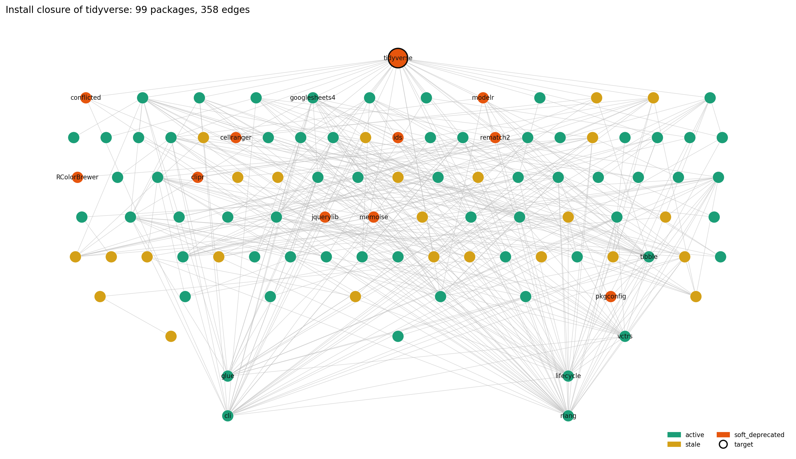

# cran_graph optimize: worked examples

Each example was produced against the snapshot at
``data/cran_snapshot_2026-05-09.sqlite`` (24,227 nodes, 240,075 edges).
The CLI reads ``--snapshot`` (default: ``data/cran_snapshot_<TODAY>.sqlite``)
and accepts one or more positional targets.

## Visualization

The closure of one or more targets renders to a layered PNG via
``cran-graph plot`` (requires ``pip install community-skills[viz]``).
The target sits at the top with a black ring; providers descend by
topological generation; node colour follows the deprecation status
column (green active, yellow stale, orange-red soft-deprecated, dark red
strong-deprecated).

```bash
cran-graph plot ggplot2 --snapshot data/cran_snapshot_2026-05-09.sqlite \
                        --output docs/images/closure_ggplot2.png

cran-graph plot tidyverse --snapshot data/cran_snapshot_2026-05-09.sqlite \
                          --output docs/images/closure_tidyverse.png \
                          --dpi 200
```



The 17-node closure of ``ggplot2`` is a clean cone with one soft-deprecated
provider (``RColorBrewer``, 49 months since last publication) sitting
mid-layer.



The 99-node closure of ``tidyverse`` exposes 11 soft-deprecated
transitive dependencies. The umbrella package itself flips
soft-deprecated under the 36-month threshold; the individual
sub-packages (``dplyr``, ``ggplot2``, ``tidyr``, ``readr``, ...) stay
active.

The Python API mirrors the CLI:

```python
from cran_graph import load_graph, optimize
g = load_graph("data/cran_snapshot_2026-05-09.sqlite")
result = optimize(g, ["ggplot2"])
print(result.install_count, result.install_set)
```

## Example 1: minimal closure for `ggplot2`

```bash
cran-graph optimize ggplot2 --snapshot data/cran_snapshot_2026-05-09.sqlite
```

```text
targets: ggplot2
install_count: 17
ok: True
skipped_base (7): R grDevices graphics grid methods stats utils
by_status:
  active: 10
  stale: 6
  soft_deprecated: 1
warnings (1):
  deprecated: RColorBrewer (no_update_for_49.2_months)
install_set:
  viridisLite
  labeling
  rlang
  withr
  farver
  S7
  RColorBrewer
  cli
  glue
  cpp11
  R6
  lifecycle
  isoband
  gtable
  scales
  vctrs
  ggplot2
```

The 7 base packages (R, grDevices, graphics, grid, methods, stats, utils)
are reported separately because they ship with R itself; they do not
need to be installed. The `RColorBrewer` warning is non-fatal: the
package resolves, but its last CRAN publication is 49 months old.

## Example 2: small closure for `knitr`

```bash
cran-graph optimize knitr --snapshot data/cran_snapshot_2026-05-09.sqlite
```

```text
targets: knitr
install_count: 5
ok: True
skipped_base (5): R grDevices methods stats tools
by_status:
  active: 5
install_set:
  yaml
  evaluate
  xfun
  highr
  knitr
```

Five hard dependencies, all active. This is the kind of clean signal
the optimizer produces when the upstream maintains a tight surface.

## Example 3: shared closure across two targets

```bash
cran-graph optimize shiny dplyr --snapshot data/cran_snapshot_2026-05-09.sqlite
```

```text
targets: shiny dplyr
install_count: 38
ok: True
skipped_base (7): R grDevices graphics methods stats tools utils
by_status:
  active: 26
  stale: 9
  soft_deprecated: 3
warnings (3):
  deprecated: pkgconfig (no_update_for_79.5_months)
  deprecated: memoise (no_update_for_53.4_months)
  deprecated: jquerylib (no_update_for_60.4_months)
```

Asking for `shiny` and `dplyr` at the same time costs 38 nodes, not
``size(shiny) + size(dplyr)``. The closure unifies shared dependencies.
Three soft-deprecated nodes are flagged as warnings; ``pkgconfig`` has
not been updated in 79 months and is still load-bearing for both.

## Example 4: rejecting deprecated dependencies

```bash
cran-graph optimize ggplot2 --snapshot data/cran_snapshot_2026-05-09.sqlite \
                            --strict-active
```

```text
targets: ggplot2
install_count: 17
ok: False
conflicts (1):
  deprecated_in_closure: RColorBrewer (no_update_for_49.2_months)
```

With ``--strict-active``, any soft- or strong-deprecated node in the
closure flips the result to ``ok=False`` and exit code 2. The closure
is still printed so the caller can audit what tripped the policy.

## Example 5: validating a local R version

```bash
cran-graph optimize ggplot2 --snapshot data/cran_snapshot_2026-05-09.sqlite \
                            --r-version 3.6
```

```text
targets: ggplot2
install_count: 17
ok: False
conflicts (7):
  r_version_constraint_violated: ggplot2 requires R >= 4.1, got 3.6
  r_version_constraint_violated: vctrs requires R >= 4.0.0, got 3.6
  r_version_constraint_violated: rlang requires R >= 4.0.0, got 3.6
  r_version_constraint_violated: glue requires R >= 4.1, got 3.6
  ...
```

When the local R version is too old, every offending edge is reported
with the consumer, the constraint, and the user-supplied version. The
closure is still computed (the user may want to know what would
install if they upgraded R first).

## Example 6: long tail (`bgumbel`)

```bash
cran-graph optimize bgumbel --snapshot data/cran_snapshot_2026-05-09.sqlite
```

```text
targets: bgumbel
install_count: 11
ok: True
warnings (1):
  deprecated: bgumbel (no_update_for_61.3_months)
install_set:
  SparseM
  mcmc
  MASS
  lattice
  coda
  Matrix
  MatrixModels
  survival
  quantreg
  MCMCpack
  bgumbel
```

A maintained-but-aging package on the CRAN long tail. The optimizer
flags the target itself as soft-deprecated (61 months since last
publication) but resolves cleanly, ordering 11 transitive dependencies
in topological order.

## Example 7: missing target

```bash
cran-graph optimize NotARealPackage --snapshot data/cran_snapshot_2026-05-09.sqlite
```

```text
targets: NotARealPackage
install_count: 0
ok: False
conflicts (1):
  missing_target: NotARealPackage
```

A target absent from the snapshot is reported as a structured conflict
without raising. Exit code 2, install set empty.

## Example 8: JSON output for downstream tooling

```bash
cran-graph optimize knitr --snapshot data/cran_snapshot_2026-05-09.sqlite --json
```

```json
{
  "ok": true,
  "targets": ["knitr"],
  "install_set": ["xfun", "yaml", "evaluate", "highr", "knitr"],
  "install_count": 5,
  "by_status": {"active": 5},
  "warnings": [],
  "conflicts": [],
  "skipped_base": ["R", "methods", "tools", "grDevices", "stats"],
  "missing_targets": []
}
```

The JSON shape is the same one returned by ``OptimizerResult.to_dict()``.
Downstream tools (CI, agent skills, package-set generators) can pipe
this directly without parsing the human view.

## Notes on the solver

- **Edge selection.** ``Depends``, ``Imports``, and ``LinkingTo`` are walked by default. ``Suggests`` and ``Enhances`` are off; pass ``--with-suggests`` or ``--with-enhances`` if a use case needs them.
- **Topological order.** Nodes appear dependency-first, so the list can be passed verbatim to ``install.packages`` without further sorting.
- **Version constraints.** The current snapshot stores only the latest version of each package. Constraints that cannot be satisfied by the latest version are reported as ``warnings``, not ``conflicts``, because the optimizer never silently downgrades.
- **Cycles.** R's hard edges are acyclic. Optional cycles via ``Suggests`` are filtered out of the topological-sort sub-graph; if a residual cycle remains, the closure falls back to alphabetical order and the situation is observable through the warnings field.
